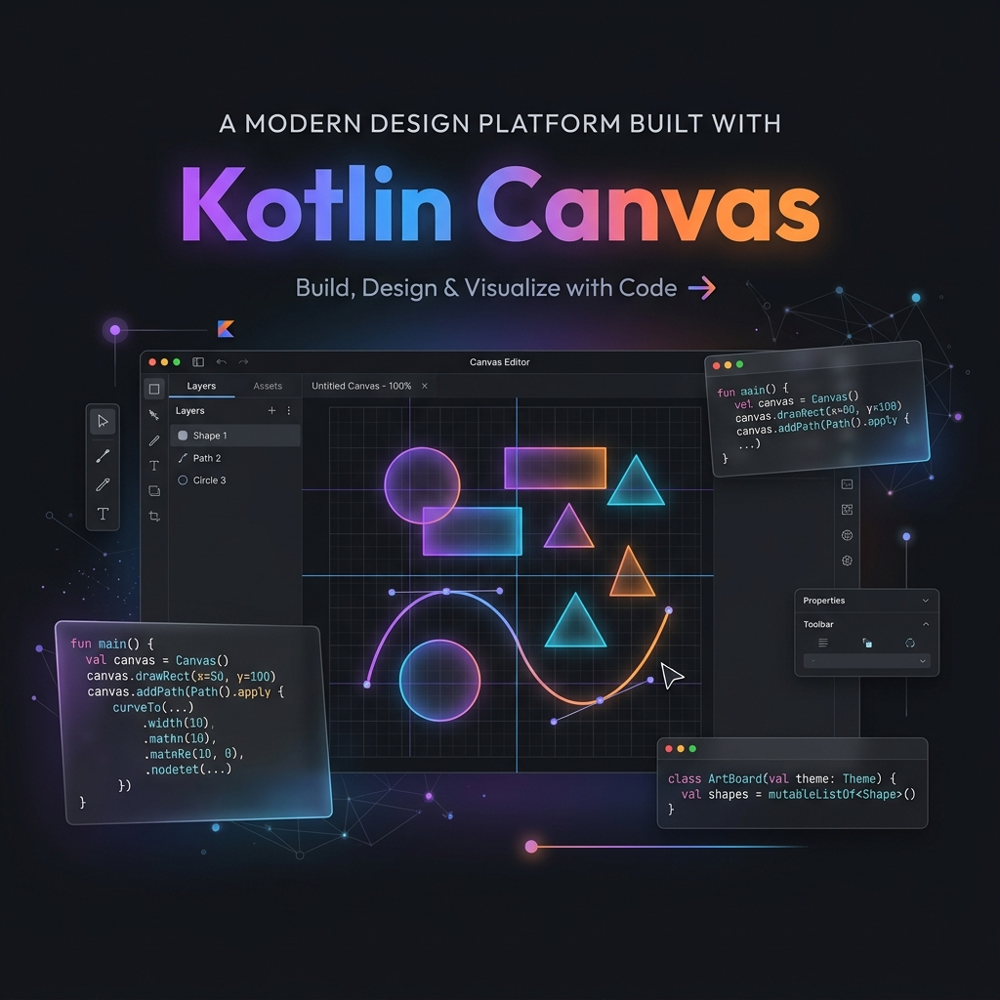
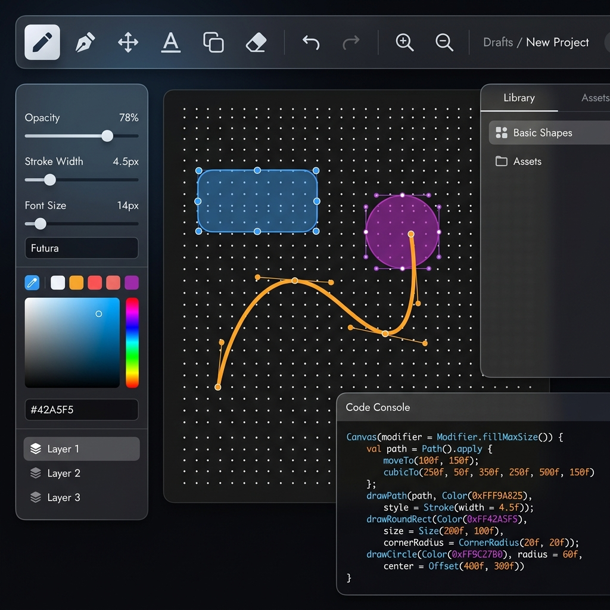

# 🎨 Gerador de designs | Canvas para KMP


Acesse pelo link: https://fgcl.github.io/IA_CanvasKotlin/  

Eu vibecodei esse projeto para ser utilizado por mim, como uma ferramenta para a criação facil de designs e animações para sites HTML e apps. Assim a IA pode saber exatamente como eu quero fazer o layout da minha aplicação e consiga gerar interfaces mais bonitas e complexas.  

Eu sei que tem outras ferramentas que fazem isso, mas eu queria fazer do meu jeito :P e ficou bom sem a poluição visual que tem em outras ferramentas.

O futuro do programador é desenvolver as ferramentas que vão ajudar a criar aplicações, e não apenas criar aplicações. Como a rockstar que tem sua própria engine.  
Espero que esse projeto te motive a criar suas próprias ferramentas e parar de usar aplicações de terceiros.  

O resto do texto abaixo foi gerado por IA e pode conter erros.



> **Transforme seus designs visuais em código Jetpack Compose ou HTML pronto para produção com um único clique.**

O **Kotlin Canvas** é um editor visual de alta performance, baseado na web, projetado para o ecossistema Kotlin Multiplatform (KMP). Ele permite que desenvolvedores e designers criem componentes de UI complexos, formas vetoriais e animações, gerando automaticamente o código Kotlin correspondente usando a API `Canvas` e Jetpack Compose.

---

## ✨ Funcionalidades

### 🖌️ Ferramentas de Design
-   **Motor Vetorial:** Crie formas com precisão usando Retângulos, Círculos, Linhas e Curvas de Bézier avançadas.
-   **Lápis & Texto:** Desenho à mão livre e suporte a texto rico com fontes personalizáveis.
-   **Biblioteca de Ícones:** Seletor de ícones integrado para prototipagem rápida.
-   **Componentes Nativos:** Adicione elementos de interface funcionais como Botões, Switches, Sliders e Barras de Progresso.

### ⚙️ Layout Profissional & Constraints
-   **Auto Layout:** Sistema de layout dinâmico estilo "Flex-box", suportando Linhas (Rows) e Colunas (Columns) com espaçamento (gap) e preenchimento (padding) customizáveis.
-   **Sistema de Constraints (Restrições):** Defina como os elementos se ancoram ao redimensionar (Esquerda, Centro, Direita, Escala, etc.).
-   **Guias de Precisão:** Réguas, grids isométricos/quadrados e snapping inteligente (magnetismo) para alinhamento perfeito de pixels.

### 🎬 Animação & Keyframes
-   **Painel de Timeline:** Uma linha do tempo completa para gerenciar animações complexas.
-   **Gestão de Keyframes:** Defina propriedades (X, Y, Opacidade, Cores) em momentos específicos para gerar código Compose animado.
-   **Controles de Playback:** Visualização em tempo real com suporte a loop.

### 💻 Geração de Código em Tempo Real
-   **Reatividade:** O editor gera comandos `DrawScope` instantaneamente enquanto você desenha.
-   **Destaque de Sintaxe:** Prism.js integrado para um código Kotlin limpo e legível.
-   **Saída Responsiva:** Opção para gerar coordenadas baseadas em porcentagem para suporte a múltiplos dispositivos.

---

## 🚀 Como Começar

Como o Kotlin Canvas é construído com tecnologias web modernas, ele não requer instalação.
1. Acesse agora mesmo pelo link https://fgcl.github.io/IA_CanvasKotlin/  

ou

1.  **Clone o repositório:**
    ```bash
    git clone https://github.com/seu-usuario/IA_CanvasKotlin.git
    ```
2. Na pasta raiz do projeto, execute python -m http.server 8000
3.  **Acesse** http://localhost:8000 em qualquer navegador moderno (Chrome, Firefox, Edge, Safari).
4.  **Comece a Desenhar!** Seu código Kotlin aparecerá na barra lateral direita instantaneamente.

---

## 🛠️ Tecnologias Utilizadas

-   **Frontend:** Vanilla JavaScript (ES6+ Modules)
-   **Estilização:** CSS3 com Glassmorphism e Design System exclusivo.
-   **Motor:** API HTML5 Canvas.
-   **Bibliotecas:**
    -   [Prism.js](https://prismjs.com/): Destaque de sintaxe.
    -   [Google Fonts](https://fonts.google.com/): Inter & Fira Code.


## 📸 Mockup do Editor



---

## ⚖️ Licença

Este projeto é de uso **Livre para fins não comerciais e pessoais**.

> [!IMPORTANT]
> **RESTRIÇÃO COMERCIAL:** É terminantemente proibida a cópia, implementação ou uso deste código (integral ou parcial) para fins lucrativos ou comerciais (ex: empresas que implementam o editor em seus sites para vender um serviço/produto) sem autorização prévia.

Para mais detalhes, consulte o arquivo [LICENSE](LICENSE).

---

<p align="center">
  Feito com ❤️ para a comunidade Kotlin (sugestão da IA '-')
</p>
